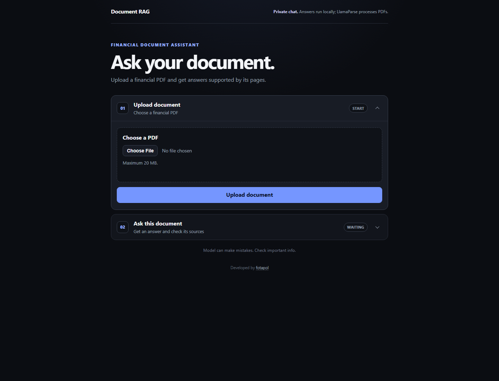
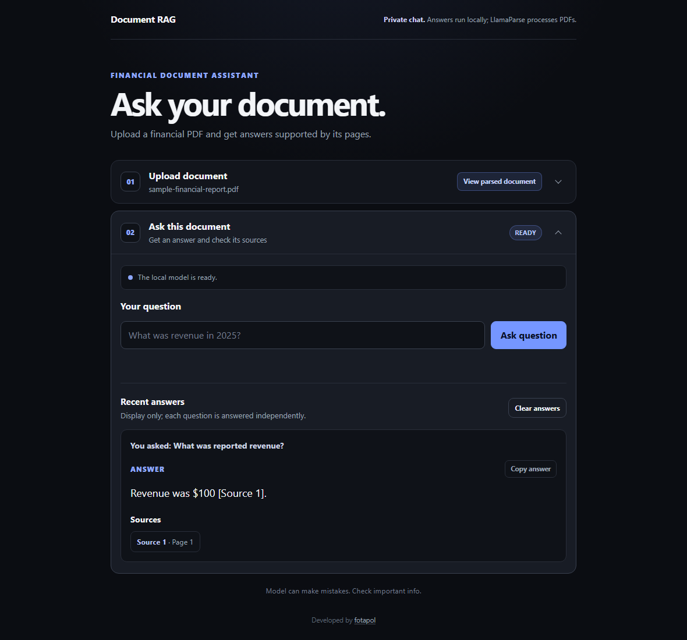

# Document RAG

An auditable, local-first RAG application for asking grounded questions about financial PDF
documents. It preserves page and source lineage from parsing through retrieval and presents every
answer with inspectable citations.


## What it does

```text
PDF upload
-> LlamaParse Markdown
-> structure-aware chunks and canonical table rows
-> in-memory BM25 + dense retrieval
-> deterministic Reciprocal Rank Fusion
-> parent-aware result diversity
-> grounded top-five context
-> Qwen3-1.7B + financial LoRA adapter
-> answer with page and chunk citations
```

The current interface supports:

- PDF upload, replacement, and removal;
- explicit parsing, indexing, model-loading, and error feedback;
- deterministic hybrid retrieval over narrative text and financial table rows;
- grounded answers from the pinned Qwen base model and unmerged LoRA adapter;
- clickable page citations and opt-in retrieval diagnostics;
- display-only answer history for the ten most recent questions;
- answer and citation copying; and
- cancellation of the browser request while an answer is being generated.

Previous answers are not model memory. Each request contains only the current question and the
chunks retrieved for it.

## Interface

Upload a financial PDF through the focused two-step interface:



Answers keep their supporting pages visible, while parsed content and retrieval diagnostics stay
collapsed until requested:



## Privacy and deployment boundary

The application is designed to run on one user's computer:

- **PDF parsing is not local.** Uploaded PDFs are sent to LlamaParse through LlamaCloud.
- Chunking, indexing, retrieval, prompting, and generation run in the local application process.
- The current PDF, index, and answer history are held only in memory and disappear on restart.
- The web server has no authentication or per-user isolation. All browser clients connected to one
  process share the current document.

Do not bind the server to a public interface or deploy it as a multi-user service without adding
authentication, isolated session state, secure storage, and a deliberate data-retention policy.

## Requirements

- Git
- [uv](https://docs.astral.sh/uv/)
- Python 3.12 (installed automatically by uv)
- A [LlamaCloud](https://cloud.llamaindex.ai/) API key
- Internet access for the first parser and Hugging Face model downloads

A CUDA-capable GPU is strongly recommended for Qwen generation. CPU execution can be very slow and
may require substantial RAM or model offloading. The default downloads include the approximately
4 GB Qwen base model, the embedding model, and the LoRA adapter.

For an NVIDIA installation, select a PyTorch build appropriate for the local driver using the
[official PyTorch installer](https://pytorch.org/get-started/locally/). After manually selecting a
CUDA wheel, use `uv run --no-sync` for application commands so a later synchronization does not
replace that wheel.

Check the runtime before downloading the language model:

```powershell
uv run --no-sync python -c "import torch; print(torch.__version__, torch.cuda.is_available())"
```

## Installation

```powershell
git clone https://github.com/fotapol/document-rag.git
Set-Location document-rag
uv sync --locked
Copy-Item .env.example .env
```

Open `.env` and set:

```dotenv
LLAMA_CLOUD_API_KEY=your_key_here
```

`.env` is ignored by Git. Never commit an API key.

Start the application:

```powershell
uv run --no-sync uvicorn document_rag.web.app:app --reload --env-file .env
```

Open <http://127.0.0.1:8000>, upload a financial PDF, wait for indexing to finish, and ask a
question. The first answer takes longer because the base model and adapter load lazily.

## Configuration

`.env.example` contains the complete configuration with pinned model revisions. The most useful
settings are:

| Variable | Default | Purpose |
|---|---:|---|
| `DOCUMENT_RAG_TOP_K` | `5` | Retrieved chunks supplied to the model |
| `DOCUMENT_RAG_CANDIDATE_K` | `20` | Candidate depth for each RRF component |
| `DOCUMENT_RAG_RRF_K` | `60` | Reciprocal-rank-fusion constant |
| `DOCUMENT_RAG_MAX_TABLE_ROWS_PER_PARENT` | `2` | Final rows allowed from one logical table |
| `DOCUMENT_RAG_MAX_INPUT_TOKENS` | `4096` | Maximum grounded prompt size |
| `DOCUMENT_RAG_MAX_NEW_TOKENS` | `128` | Maximum generated response size |
| `DOCUMENT_RAG_GENERATION_DEVICE_MAP` | `auto` | Transformers model placement |

The application pins:

- `BAAI/bge-small-en-v1.5` for dense embeddings;
- `Qwen/Qwen3-1.7B` as the base generator; and
- [`fotapol/qwen3-1.7b-financial-rag-lora-v4`](https://huggingface.co/fotapol/qwen3-1.7b-financial-rag-lora-v4)
  as an unmerged PEFT adapter.

## Quality checks

The unit suite uses fake parser, retriever, and generator boundaries. It does not require an API
key, Internet access, Hugging Face access, or a GPU.

```powershell
uv run --no-sync ruff check .
uv run --no-sync ruff format --check .
uv run --no-sync mypy
uv run --no-sync pytest
```

CI runs the same checks and a Gitleaks secret scan for every pull request and push to `main`.

## Documentation

- [Architecture](docs/ARCHITECTURE.md) explains component boundaries, table-aware retrieval,
  lineage, determinism, and local session state.
- [Evaluation](docs/EVALUATION.md) records the frozen retrieval baselines and base-versus-adapter
  methodology and results.
- [Training](docs/TRAINING.md) explains the deterministic RAG-shaped data exporter and the adapter
  training handoff.
- [Contributing](CONTRIBUTING.md) describes the development workflow.
- [Security policy](SECURITY.md) explains how to report sensitive problems.

## Known limitations

- LlamaParse is a third-party cloud dependency and can change independently of this repository.
- There is no authentication, persistent index, vector database, or multi-user session isolation.
- Browser cancellation does not guarantee interruption of model work already running in a Python
  worker thread.
- Retrieval and generation can still select the wrong row, omit evidence, calculate incorrectly,
  or produce an unsupported claim.
- The adapter improves the recorded validation metrics but remains imperfect, especially on
  financial reasoning and unsupported-question refusal.
- English financial reports are the primary tested input.

## Data and model attribution

The research and training workflows use:

- [FinQA](https://github.com/czyssrs/FinQA), released under the MIT License;
- [DocFinQA](https://huggingface.co/datasets/kensho/DocFinQA), marked MIT;
- [BAAI/bge-small-en-v1.5](https://huggingface.co/BAAI/bge-small-en-v1.5), marked MIT; and
- [Qwen/Qwen3-1.7B](https://huggingface.co/Qwen/Qwen3-1.7B), released under Apache-2.0.

Datasets, model weights, generated indexes, and evaluation artifacts are not committed to this
repository. Follow each upstream project's terms and citation guidance when reproducing the work.

## License

The project source code is released under the [MIT License](LICENSE).
