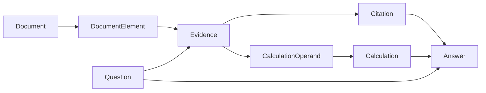

# Domain models

The domain layer contains framework-independent contracts used across
dataset preparation, document ingestion, retrieval, evaluation, and API layers.

## Model relationships

## Responsibilities

### Document

Represents an original financial or business document.

### DocumentElement

Represents a source-level part of a document:

- heading;
- paragraph;
- table;
- table row;
- caption;
- footnote.

Every element preserves its document ID, page number, section, type,
source text, and optional table coordinates.

### Question

Represents a question asked against a particular document.

### Evidence

Represents retrieved context selected as relevant to a question.
It preserves retrieval metadata and links back to source document elements.

### Calculation

Represents an auditable deterministic calculation, including operands,
operation, result, units, and source evidence.

### Citation

Represents a user-facing reference to the document evidence supporting
an answer.

### Answer

Represents the final grounded result, including citations and optional
calculations.

## Architectural boundary

Domain models do not depend on Docling, LlamaIndex, Qdrant, FastAPI,
PostgreSQL, or Hugging Face classes.

External representations must be converted into domain models at the
application boundary.